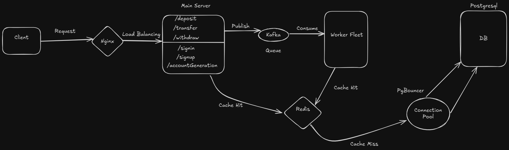

# Highly Scalable Financial Application

## Description

This project is a highly scalable financial application designed to handle high loads efficiently. While its functionality is limited to basic financial tasks, the primary focus is on scalability and performance optimization. The architecture leverages PostgreSQL with PgBouncer for connection pooling, Redis, Kafka, and Nginx to ensure smooth operation under heavy traffic conditions.

## Key Architecture

- **Scalability:** Built to handle high traffic and concurrent transactions.
- **PostgreSQL with PgBouncer:** Efficient database connection pooling for optimized query performance.
- **Redis for Session Management & Caching:** Enhances performance by caching frequently accessed data.
- **Kafka for Sequential User Transactions:** Ensures that transactions are processed sequentially for each individual account number. This guarantees that operations such as deposits, withdrawals, and transfers are applied in the correct order for every account, preventing race conditions and ensuring accurate account balance updates even under heavy load.
- **Nginx for Load Balancing:** Distributes incoming traffic across four servers with 16 workers in each for better load management.

## Architecture Diagram


## Implementation Details
In the implementation, the main server and workers are kept the same since running both on a local machine would introduce unnecessary complexity without any practical benefit in a development setup. Therefore, both components share the same environment.

Kafka is used as a queue to ensure that transactions are processed sequentially. Transactions are hashed based on the account number to maintain order consistency and prevent conflicts in balance updates.

To maintain the queue, Kafka is configured with an equal number of workers and partitions to ensure that transactions are processed in sequence. Kafka is set up with 3 brokers in a single cluster to provide fault tolerance and load distribution.

Redis is configured using a cluster of 9 nodes, consisting of 3 masters and 2 slaves for each master. The number of nodes is configurable and can be adjusted based on system requirements.

## Installation

### Prerequisites

- Node.js & npm
- Docker & Docker Compose

### Setup

```sh
# Clone the repository
git clone https://github.com/plebsicle/microfin.git
cd microfin

# Install dependencies
npm install

# Start PostgreSQL with PgBouncer using Docker
cd database
docker-compose up -d

# Start Redis cluster using Docker
cd redis
docker-compose up -d
redis-cli --cluster create 192.168.1.2:6379 192.168.1.4:6379 192.168.1.5:6379 192.168.1.6:6379 192.168.1.7:6379 192.168.1.8:6379 192.168.1.9:6379 192.168.1.10:6379 192.168.1.11:6379 --cluster-replicas 2

# Start Kafka services using Docker
cd kafka
docker-compose up -d

# Start Nginx using Docker
cd nginx
docker-compose up -d

# Start the application servers
npm run dev  # Server 1
npm run dev1 # Server 2
npm run dev2 # Server 3
npm run dev3 # Server 4
```

## Usage

1. Users can perform basic financial transactions.
2. The system ensures data consistency and availability.
3. Load is distributed efficiently using Nginx.

## Configuration
- PostgreSQL and PgBouncer settings are configured in `database/db.ts`.
- Kafka topics and Redis configurations should be set in `config`.

## Test Results

The system has been stress-tested under high load conditions, ensuring:

This project was stress-tested using **K6** to simulate high load conditions. The test focused on various scenarios, including:

- **Account creation**
- **User sign-ins**
- **Deposits, withdrawals, and transfers**
  
The results showed optimal performance even under heavy traffic with 100% success rate for all transactions, as summarized in the performance benchmarks.

### Performance Benchmarks

| Metric                          | Value      |
|----------------------------------|-----------|
| **Requests Per Second (RPS)**    | 3626.18/s |
| **Average Response Time (ms)**  | 515.29     |
| **Account Duration (ms)**       | Avg: 553.57, p(90): 922.48, p(95): 1048.81 |
| **Deposit Duration (ms)**       | Avg: 624.92, p(90): 1066.78, p(95): 1230.79 |
| **Sign-in Duration (ms)**       | Avg: 457.01, p(90): 736.04, p(95): 1186.81 |
| **Transfer Duration (ms)**      | Avg: 558.36, p(90): 947.55, p(95): 1131.11 |
| **Withdraw Duration (ms)**      | Avg: 344.32, p(90): 609.58, p(95): 773.48 |


## API endpoints

- `/api/signup/`
- `/api/signin/`
- `/api/accountGeneration/`
- `/api/deposit/`
- `/api/withdraw/`
- `/api/transfer/`
